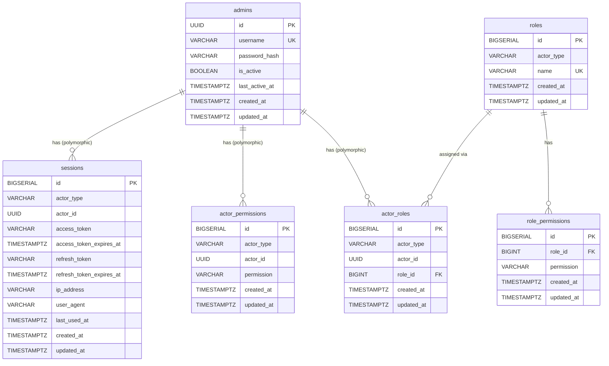

# Auth Module ERD

This diagram shows the Entity Relationship Diagram for the `auth` schema.

## Table Descriptions

| Table | Description |
|-------|-------------|
| `admins` | Admin user accounts with authentication credentials |
| `roles` | Role definitions scoped by `actor_type` (e.g., admin, user) |
| `role_permissions` | Permissions granted to a role |
| `actor_roles` | Links actors (polymorphic via `actor_type` + `actor_id`) to roles |
| `actor_permissions` | Direct permissions granted to actors (bypassing roles) |
| `sessions` | Active sessions with access/refresh tokens for actors |

## Polymorphic Pattern

The auth module uses a polymorphic pattern for actors:
- `actor_type`: Identifies the type of actor (e.g., `"admin"`)
- `actor_id`: UUID reference to the actor's record in their respective table

This allows the same permission system to be used across different actor types (admins, future user types, etc.).
