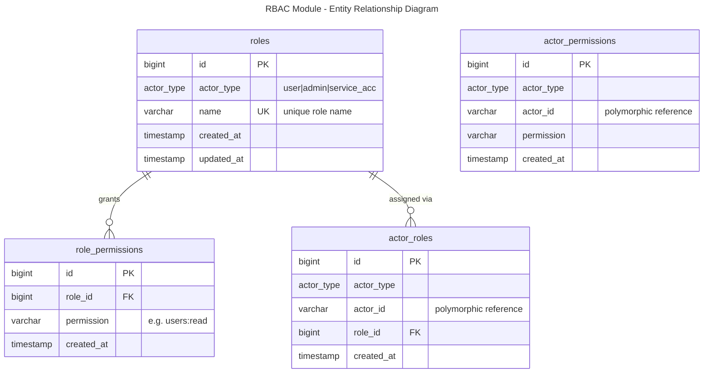

```mermaid
---
title: RBAC Module - Entity Relationship Diagram
---
erDiagram
    roles {
        bigint id PK
        actor_type actor_type "user|admin|service_acc"
        varchar name UK "unique role name"
        timestamp created_at
        timestamp updated_at
    }

    role_permissions {
        bigint id PK
        bigint role_id FK
        varchar permission "e.g. users:read"
        timestamp created_at
    }

    actor_roles {
        bigint id PK
        actor_type actor_type
        varchar actor_id "polymorphic reference"
        bigint role_id FK
        timestamp created_at
    }

    actor_permissions {
        bigint id PK
        actor_type actor_type
        varchar actor_id "polymorphic reference"
        varchar permission
        timestamp created_at
    }

    roles ||--o{ role_permissions : "grants"
    roles ||--o{ actor_roles : "assigned via"
```
